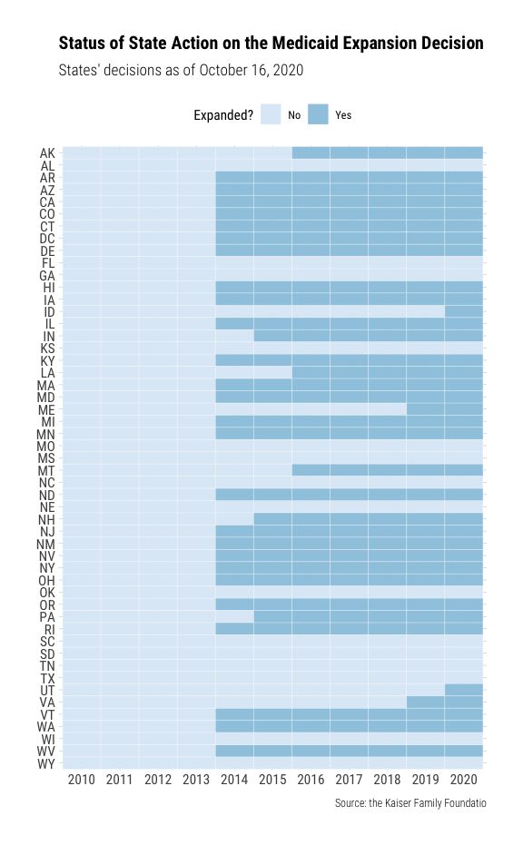

<!-- README.md is generated from README.Rmd. Please edit that file -->

# About `{aca.medicaid.expansion}`

The package `{aca.medicaid.expansion}` contains a dataset `status`,
which includes the status of state action on the ACA Medicaid expansion
decision. The first version of the data is from [the Kaiser Family
Foundation](https://www.kff.org/medicaid/issue-brief/status-of-state-medicaid-expansion-decisions-interactive-map/).

# Installation

You can install the current version of `{aca.medicaid.expansion}` from
Github with:

``` r
# install.packages("remotes")
packageVersion("remotes") # Version 2.2.0 required
remotes::install_github("jjchern/aca.medicaid.expansion")
```

# Examples

``` r
library(tidyverse)
#> ── Attaching packages ──────────────────────────────────────────────────────────── tidyverse 1.2.1 ──
#> ✓ ggplot2 3.3.0     ✓ purrr   0.3.4
#> ✓ tibble  3.0.1     ✓ dplyr   1.0.0
#> ✓ tidyr   1.1.0     ✓ stringr 1.4.0
#> ✓ readr   1.3.1     ✓ forcats 0.4.0
#> Warning: package 'tibble' was built under R version 3.6.2
#> Warning: package 'tidyr' was built under R version 3.6.2
#> Warning: package 'purrr' was built under R version 3.6.2
#> Warning: package 'dplyr' was built under R version 3.6.2
#> ── Conflicts ─────────────────────────────────────────────────────────────── tidyverse_conflicts() ──
#> x dplyr::filter() masks stats::filter()
#> x dplyr::lag()    masks stats::lag()
library(lubridate)
#> 
#> Attaching package: 'lubridate'
#> The following object is masked from 'package:base':
#> 
#>     date

# Data
aca.medicaid.expansion::status
#> # A tibble: 51 x 6
#>    fips  usps  state       expansion_date expansion_status   description        
#>    <chr> <chr> <chr>       <date>         <chr>              <chr>              
#>  1 01    AL    Alabama     NA             Not Adopted        <NA>               
#>  2 02    AK    Alaska      2015-09-01     Adopted and Imple… Implemented expans…
#>  3 04    AZ    Arizona     2014-01-01     Adopted and Imple… Implemented expans…
#>  4 05    AR    Arkansas    2014-01-01     Adopted and Imple… Implemented expans…
#>  5 06    CA    California  2014-01-01     Adopted and Imple… Implemented expans…
#>  6 08    CO    Colorado    2014-01-01     Adopted and Imple… Implemented expans…
#>  7 09    CT    Connecticut 2014-01-01     Adopted and Imple… Implemented expans…
#>  8 10    DE    Delaware    2014-01-01     Adopted and Imple… Implemented expans…
#>  9 11    DC    District o… 2014-01-01     Adopted and Imple… Implemented expans…
#> 10 12    FL    Florida     NA             Not Adopted        <NA>               
#> # … with 41 more rows

# Convert the dataset to a state-year panel

add_st_yr_dummy = function(dta, bgn_yr, end_yr) {
     dta %>%
         mutate(year = list(bgn_yr:end_yr)) %>%
         unnest(year) %>%
         mutate(round_exp_year = round_date(expansion_date, "year")) %>%
         mutate(round_exp_year = year(round_exp_year)) %>%
         mutate(expansion = if_else(year < round_exp_year |
             is.na(round_exp_year), FALSE, TRUE)) %>%
         select(-round_exp_year)
}

aca.medicaid.expansion::status %>%
    add_st_yr_dummy(bgn_yr = 2010, end_yr = 2020) %>% 
    select(usps, year, expansion) %>% 
    print() -> st_yr_expansion
#> # A tibble: 561 x 3
#>    usps   year expansion
#>    <chr> <int> <lgl>    
#>  1 AL     2010 FALSE    
#>  2 AL     2011 FALSE    
#>  3 AL     2012 FALSE    
#>  4 AL     2013 FALSE    
#>  5 AL     2014 FALSE    
#>  6 AL     2015 FALSE    
#>  7 AL     2016 FALSE    
#>  8 AL     2017 FALSE    
#>  9 AL     2018 FALSE    
#> 10 AL     2019 FALSE    
#> # … with 551 more rows

# Plot the expansion status for each state

st_yr_expansion %>% 
    mutate(usps = forcats::fct_rev(usps)) %>% 
    mutate(year = as.character(year)) %>% 
    mutate(expansion = if_else(expansion, "Yes", "No")) %>% 
    ggplot(aes(x = year, y = usps, fill = expansion)) +
    geom_tile(colour = "white") +
    labs(x = NULL, y = NULL, fill = "Expanded?",
         title = "Status of State Action on the Medicaid Expansion Decision",
         subtitle = "States' decisions as of October 16, 2020",
         caption = "Source: the Kaiser Family Foundatio") +
    hrbrthemes::theme_ipsum_rc(plot_title_size = 15) +
    theme(legend.position = "top") +
    scale_fill_brewer() 
```


